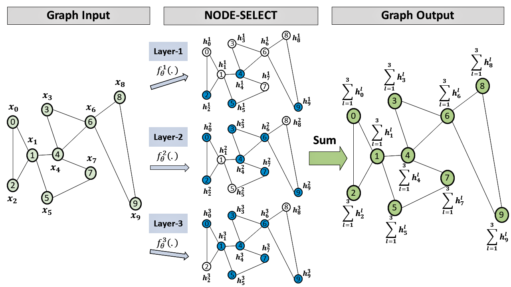

# NODE-SELECT Graph Neural Networks

This software package implements the work done in the paper "NODE-SELECT: A FLEXIBLE GRAPH NEURAL NETWORK BASED ON REALISTIC PROPAGATION SCHEME". This is the official Pytorch repository.


<a name="installation"></a>
## Installation
Install any of the relevant packages if not already installed:
* Pytorch (tested on 1.4.0) - preferably version 1.4.0 or later
* Numpy   (tested on 1.19.2)
* Pandas  (tested on 1.1.2) 
* Scikit-learn (tested on 0.23.2) 
* Matplotlib (tested on 3.2.2)
* PyTorch-Geometric (tested on 1.4.3)
* Tabulate (tested on 0.8.7)
- Pytorch, Numpy, Pandas, Scikit-learn, Matplotlib, and Tabulate

```bash
pip install torch torchvision 
pip install numpy
pip install pandas
pip install scikit-learn
pip install matplotlib
pip install tabulate
```

- PyTorch Geometric [documentation](https://pytorch-geometric.readthedocs.io/en/latest/notes/installation.html#installation)


<a name="usage"></a>
## Usage
Once all the aforementionned requirements are satisfied, one can easily our codes using the following set of flags
* --benchmark : benchmark dataset (default: cora)
    * choices are cora, citeseer, cora-f , pubmed, coauthor-p, coauthor-c, amazon-p, and amazon-c
* --framework : model choices (default: NSGNN)
    * choices are NSGNN, GCN, GAT, GRAPHSAGE, and MLP
* --layers: number of layers needed to construct your model (default:1)
* --neurons: number of neurons to use for hidden layers of your model. \*\*\*not needed for NSGNN
* --lr: learning rate (default:0.01)
* --num_splits: number of different data-splits to use for training and testing mode (default:10)
* --weight_decay: weight decay to use for Adam optmizer (default:0.0005)
* --heads: number of attention-heads to use for GAT \*\*\*only needed for GAT (default:8)
* --depth: propagation depth of NSGNN filter \*\*\*only needed for NODE-SELECT (default:1)
* --random: whether to randomize the seeds used for training/testing the model (default:False)


